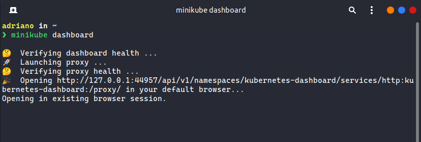
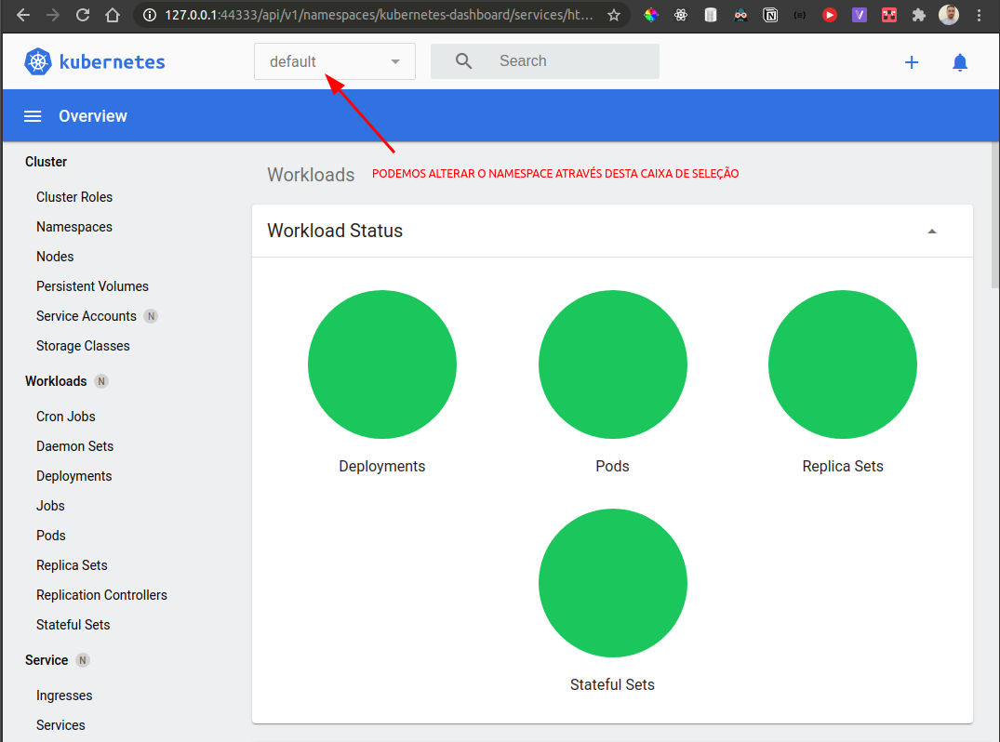
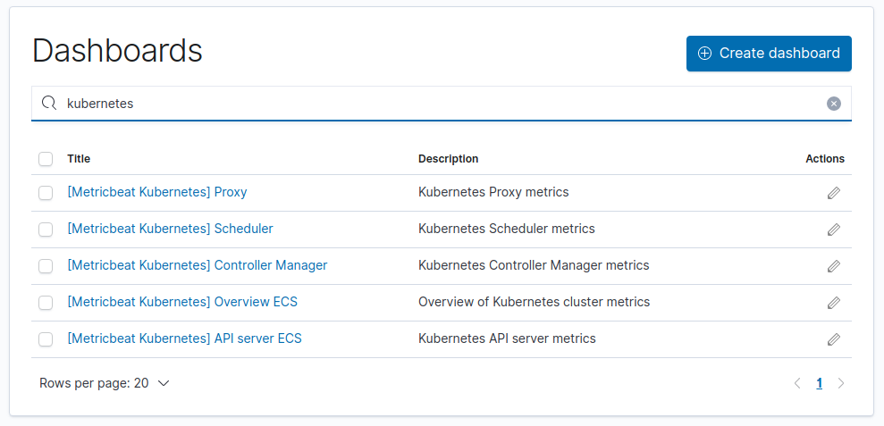
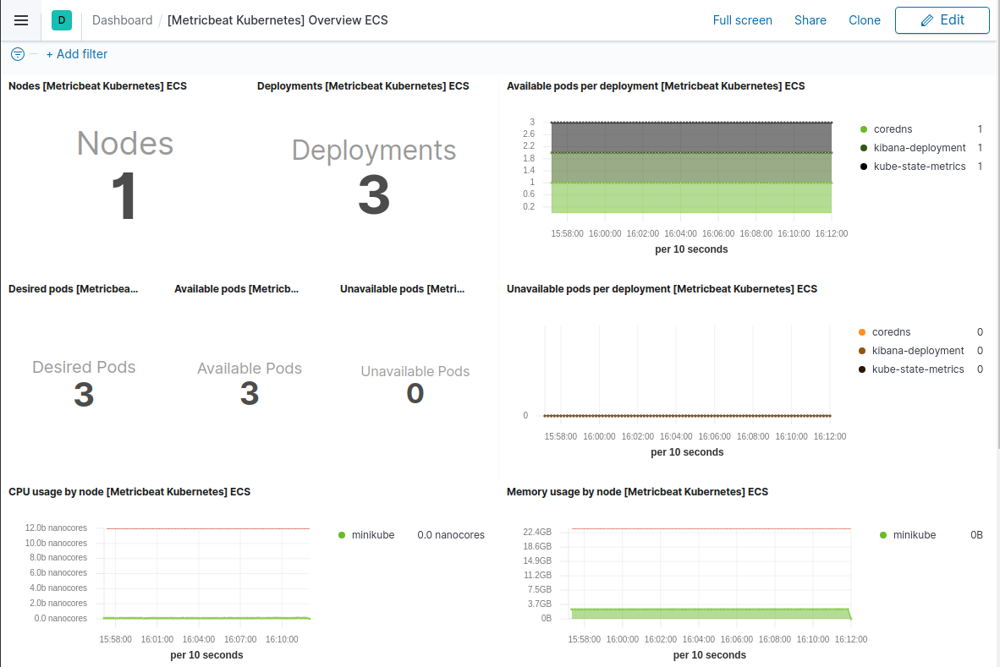

# Observabilidade Kubernetes

Este repositório trata-se de um tutorial de como configurar a observabilidade de um cluster Kubernetes utilizando um cojunto de ferramentas conhecido como [Elastic Stack](https://www.elastic.co/pt/elastic-stack).

## :rocket: Tecnologias

- [Minikube](https://minikube.sigs.k8s.io/docs/start/)
- [Kubernetes](https://kubernetes.io/)
- [Elasticsearch](https://www.elastic.co/)
- [Kibana](https://www.elastic.co/kibana)
- [Metricbeat](https://www.elastic.co/beats/metricbeat)

<a target="_blank" href="https://minikube.sigs.k8s.io/docs/start">
  
</a>
<a target="_blank" href="https://kubernetes.io/">
  
</a>
<a target="_blank" href="https://www.elastic.co/">
  
</a>
<a target="_blank" href="https://www.elastic.co/kibana">
  
</a>
<a target="_blank" href="https://www.elastic.co/beats/metricbeat">
  
</a>
<br>
<br>

## Passo 1: Instalar o minikube

Quem já tentou conhecer o Kubernetes instalando na máquina local sabe que o processo é complexo e oneroso. Para resolver este problema surgiu o `minikube`, a versão de desenvolvimento do Kubernetes, criada para realizar testes e conhecer a tecnologia antes de implantar em produção.

A instalação do minikube pode mudar de acordo com o sistema operacional, desta forma, é recomendado seguir os passos descritos na [documentação oficial](https://minikube.sigs.k8s.io/docs/start/).

### Execução padrão

Após a instalação, podemos iniciar o minikube com o seguinte comando:

```bash
# este comando irá iniciar o minikube com a configuração padrão
minikube start
```

### Execução customizada

Caso queira iniciar o minikube especificando as configurações de hardware, podemos utilizar o seguinte comando:

```bash
# ajustar o número de cpus e espaço de memória conforme capacidade da sua máquina
minikube start --cpus 2 --memory 6000
```

### Dashboard

O minikube também fornece uma página web para visualização de dados:

```bash
# Uma nova aba sera aberta no seu navegador
minikube dashboard
```

A saída do console deverá ser parecido com:



Até a data de publicação deste documento a página possui o seguinte layout:



### Resetar minikube

Se por algum motivo você sinta a necessidade de limpar o minikube e começar do zero, você pode executar o seguinte comando:

```bash
minikube delete --all --purge
```

A flag `-all` deleta todos os perfis, enquanto a flag `--purge` deleta a pasta `.minikube` do seu diretório pessoal.

## Passo 2: Instalar o Elasticsearch

Para este exemplo o Elasticsearch será utilizado para armazenar as métricas de infra-estrutura (host, kubernetes, etc).

```bash
kubectl create -f elasticsearch-kubernetes.yaml # o arquivo esta na pasta raiz deste repositório
```

`Observação`: ignorar esta etapa caso possua o elasticsearch disponível em cloud.

## Passo 3: Instalar o Kibana

O Kibana será utilizado para consumir métricas do Elasticsearch e exibi-las em um painel com diversos formatos de visualização.

```bash
kubectl create -f kibana-kubernetes.yaml # o arquivo esta na pasta raiz deste repositório
```

`Observação`: ignorar esta etapa caso possua o kibana disponível em cloud.

## Passo 4: Instalar o kube-state-metrics

O `kube-state-metrics` é um serviço que escuta o servidor da API Kubernetes e gera métricas sobre o estado dos objetos (nós e pods, por exemplo).

```bash
kubectl apply -f https://raw.githubusercontent.com/gjeanmart/kauri-content/master/spring-boot-simple/k8s/kube-state-metrics.yml
```

## Passo 5: Instalar o metricbeat

O metricbeat é um coletor de métricas capaz de monitorar diversos serviços, tais como Kubernetes, Kafka, RabbitMQ, Docker, Nginx, MongoDB, Tomcat, dentre muitos outros.

Para instalação é necessário editar o arquivo `metricbeat-kubernetes.yaml` localizado na raiz deste repositório ou efetuar o download do arquivo [original](https://www.elastic.co/guide/en/beats/metricbeat/current/running-on-kubernetes.html):

```bash
curl -L -O https://raw.githubusercontent.com/elastic/beats/7.10/deploy/kubernetes/metricbeat-kubernetes.yaml
```

### Editar o YAML

#### Elasticsearch local

Caso esteja utilizando o elasticsearch em sua máquina local, substitua a variável de ambiente `ELASTICSEARCH_HOST` por `localhost`. Caso esteja rodando no minikube, substitua pelo endereço IP do cluster:

```bash
# exibe o endereço IP do cluster
minikube ip
```

Substituir a variável de ambiente `ELASTICSEARCH_PORT`. Caso o elasticsearch esteja executando dentro do minikube/kubernetes, podemos descobrir utilizando o seguinte comando:

```bash
kubectl get services -o wide
#### A SAÍDA SERÁ SEMELHANTE A ESSA:
# elasticsearch   NodePort    10.96.53.63     <none>        9200:31178/TCP   56m   component=elasticsearch
### OBSERVAÇÃO: A PORTA NESTE CASO É 31178
```

#### Elasticsearch em nuvem

Para casos onde o elasticsearch esteja em uma *cloud*, é necessário editar duas variável de ambiente:

- Substituir `ELASTIC_CLOUD_ID` pelo valor disponibilizado em sua cloud.
- Substituir `ELASTIC_CLOUD_AUTH` pelo valor disponibilizado em sua cloud.

### Realizar o deploy

```bash
kubectl create -f metricbeat-kubernetes.yaml
```

## Passo 6: Habilitar dashboards

Seguindo os passos anteriores as métricas provavelmente devem estar sendo capturadas. No entanto, é necessário solicitar ao metricbeat a criação dos templates no Kibana para evitar uma configuração manual. Tal ação pode ser executada através dos seguintes comandos:

```bash
# 1: listar os pods do namespace kube-system
kubectl get pods -n kube-system

# 2: procurar pelo pod do metricbeat, normalmente tem o seguinte padrão: metricbeat-{sufixo}

# 3: conectar-se ao terminal do pod
kubectl exec -it ${pod_name} -n kube-system -- sh

# 4: executar o comando abaixo substituindo as variáveis:
# ${ELASTICSEARCH_IP} ${ELASTICSEARCH_PORT}, 
# ${KIBANA_IP} ${KIBANA_PORT}
metricbeat setup -e \
  -E output.logstash.enabled=false \
  -E output.elasticsearch.hosts=['${ELASTICSEARCH_IP}:${ELASTICSEARCH_PORT}'] \
  -E output.elasticsearch.username=elastic \
  -E output.elasticsearch.password=chageme \
  -E setup.kibana.host=${KIBANA_IP}:${KIBANA_PORT}
```

## Passo 7: Acessar o Kibana

Os dashboards do Kibana estão disponíveis através do seguinte endpoint:

```bash
http://${KIBANA_IP}:${KIBANA_PORT}/app/dashboards#/
```

Após acessar o endereço, estará disponível uma lista de templates. Podemos pesquisar por `Kubernetes` conforme o exemplo a seguir.



Selecionando a opção `[Metricbeat Kubernetes] Overview ECS` temos a seguinte visualização:



Pronto, agora você tem acesso a diversas métricas para monitorar o seu cluster :)
